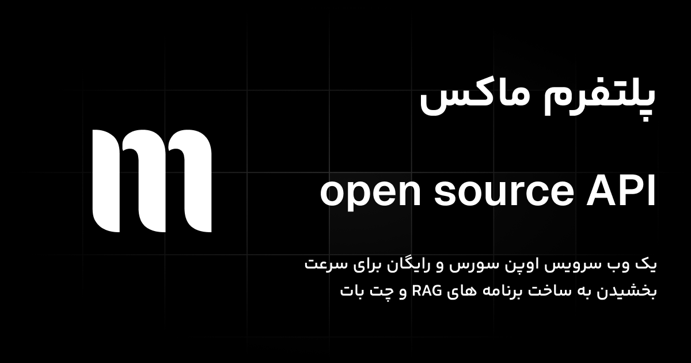

# 
# Maux-API: RAG AI Workflow Simplified 🚀

Welcome to **Maux-API** – an open-source API designed to help users quickly create RAG (Retrieval-Augmented Generation) AI workflows. Built by the team at [ai.maux.space](https://ai.maux.space), this project is free for anyone to use, with a special focus on supporting the Persian language.

## 🌟 Features

- **/embed**: Generates embeddings using the "Alibaba-NLP/gte-multilingual-base" model. This route requires a ~700MB model to be downloaded.
- **/extract**: Extracts content from supported files such as PDFs, CSVs, DOC/DOCX, TXT, and Markdown files.
- **/count**: Counts the tokens in the given content, helping you manage token usage effectively.

## 🛠 Installation

To get started with Maux-API, follow these steps:

1. **Clone the Repository:**

    ```bash
    git clone https://github.com/xmannii/Maux-API.git
    cd Maux-API
    ```

2. **Create and Activate a Virtual Environment:**

    ```bash
    python -m venv venv
    source venv/bin/activate  # On Windows use `venv\Scripts\activate`
    ```

3. **Install the Required Dependencies:**

    ```bash
    cd app
    pip install -r requirements.txt
    cd ..
    ```

4. **Run the API:**

    ```bash
    uvicorn app.main:app --reload
    ```

## 📚 Usage

Once the API is up and running, you can use the following routes:

### 🔍 `/extract`

**Description:** Extracts content from a variety of file formats.

- **Supported Formats:** `.pdf`, `.csv`, `.doc`, `.docx`, `.txt`, `.md`

**Response:**

```json
{
    "filename": "example.pdf",
    "file_type": "pdf",
    "extraction_time": "0:00:01.123456",
    "word_count": 1024,
    "content": [
        {
            "text": "Extracted text from the PDF",
            "page_number": 1
        }
    ]
}
```

### 📝 `/count`

**Description:** Counts the number of tokens in the given content.

**Parameters:**

- `content` (required): The content to count tokens for.
- `model` (optional): The model to use for counting tokens. Defaults to "gpt-3.5-turbo".
- `token_limit` (optional): The maximum number of tokens to count. Defaults to None.

**Response:**

```json
{
    "model": "gpt-3.5-turbo",
    "num_tokens": 1024,
    "token_limit": 1000,
    "within_limit": true
}
```

### 📝 `/embed`

**Description:** Generates embeddings for the given text using the "Alibaba-NLP/gte-multilingual-base" model.

**Parameters:**

- `text` (required): The text to generate embeddings for.

**Response:**

```json
{
    "object": "list",
    "data": [
        {
            "object": "embedding",
            "index": 0,
            "embedding": [0.1, 0.2, 0.3, 0.4, 0.5]
        }
    ],
    "model": "Alibaba-NLP/gte-multilingual-base"
}
```

**Discarding Embeddings:**

If you want to discard the embeddings, you can omit its Route from the main.py file and remove the corresponding import statement.


### 📁 Examples

We have added some examples of how to use the APIs in the `examples` folder.

### 🛠️ Contributions

this project is licensed under the Apache License 2.0 and fully open-source. you are welcome to contribute to this project by submitting issues, pull requests, or suggesting new features.

